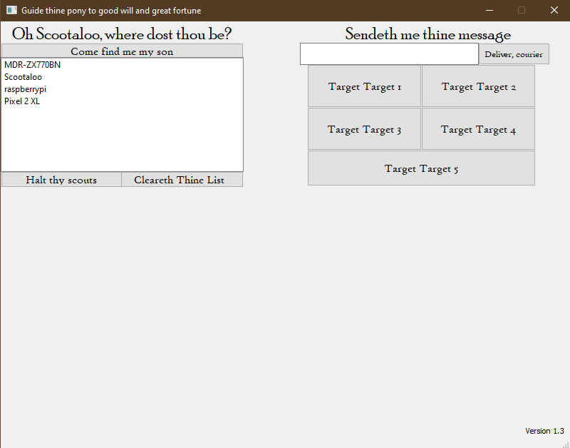

# Scootaloo
This was a program written for ME382: Introduction to Design at Oregon State University winter term 2020. It controlled a robot through an obstacle course and fired ping pong balls at targets for competition, taking input from a gamepad and sending commands over bluetooth to the robot. Each "command" is a single character, which the robot then mapped to specific actions. Robot code is not included, I don't have it and it was written by another team member.

This program communicated with our robot, named Scootaloo, which had an Arduino Uno with an HC-05 bluetooth module attached as well as four drive motors and a flywheel motor for launching ping pong balls. The rest of the robot (except purchased wheels) was either 3D printed, machined from scrap metal, or laser cut. Total cost fell below $200.

The code here (except for additional commenting) is how it was on competition day, and was mostly written in a week and half, maybe two weeks. Because of this, the GUI is a bit silly, but it was a tough course with many late nights, where humor goes a long way. If you wish to use, adapt, modify, or repurpose the program for coursework I do appreciate crediting me in your report, and if you reach out to me I can answer questions __only regarding the code, not any coursework. Ensuring you can use my code for part of YOUR project is YOUR responsibility with YOUR instructor/professor__.

## Dependencies
This is built using the Qt framework in C++, licensed under GPL3.

## Usage
To use the program, follow these steps:
1. Plug a gamepad into the computer
1. Boot the program
1. Scan for connected devices with the top button on the left, labeled "Come find me my son"
1. Use the bottom left button below the list labeled "Halt thy scouts" to stop the scan
1. Double click a list item to connect to that device
1. Use the gamepad, the five targetting buttons, or the text input to send "commands" to the connected device.

## Known Bugs
Due to the time constraints of the course and the higher priority of many other robot functions, this program does contain many bugs. Most notably, the gamepad __must be plugged in before starting the program__, and that __switching which device to communicate with may require restarting the program__. These are fixable, but were not considered worth fixing compared to other prioritized failure modes on the robot from our failure modes and effects analysis (FMEA). During competition our solution was to simply restart the program.

## Other notes
This program can also communicate with a paired Raspberry Pi without any modifications to current code.
Check *controls.cpp* for which gamepad event sends which character over bluetooth.
Even though analog sticks have different values based on the "location" of the stick the program uses them as a sort of "on/off" control, so no variable speed. This can be changed, but was not considered to be worth the time compared to other priorities on the robot.
